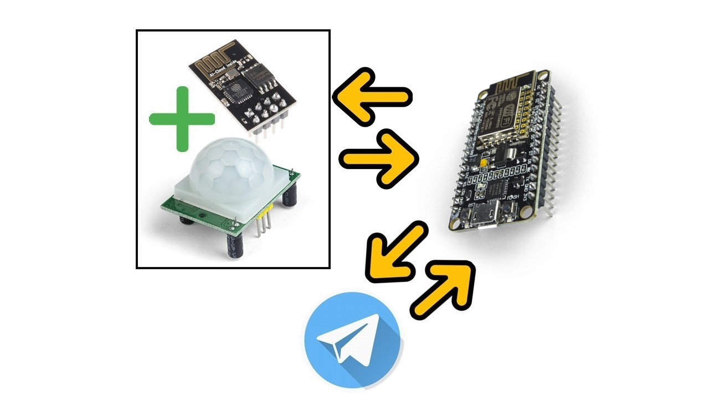
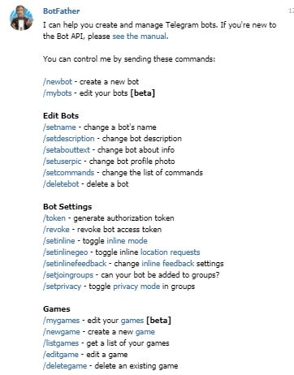
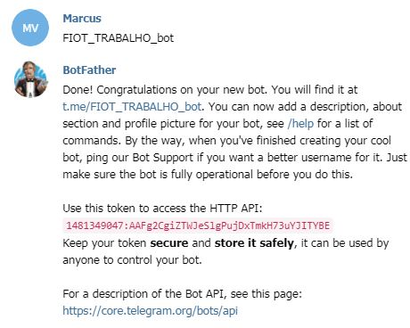
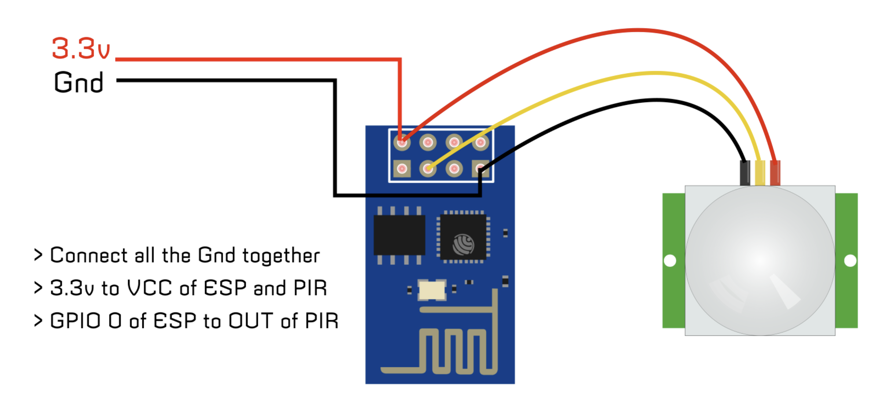
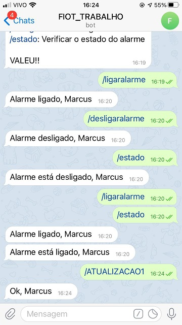
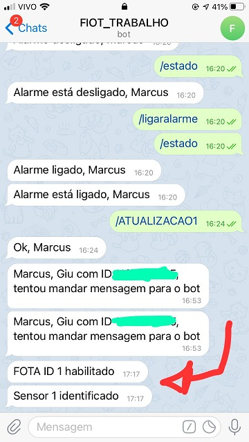
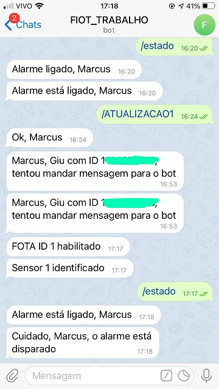

# Alarme Inteligente

## Requisistos

- Conhecer programação em linguagem C
- Conhecer eletrônica básica
- Saber usar IDE Arduino

## Introdução

Pensando na segurança da sua casa e facilidade de uso, este repositório demonstra um projeto para monitorar pontos da casa através de mensagens via Telegram e sensores. 

Ao sensor identificar alguma presença, seu celular receberá uma mensagem via Telegram avisando-o. Com o Telegram, é possível ativar avisos, alarme com segurança (ativando sirene ou não), entre outros. Tudo é configurável!

A ideia do projeto é um microcontrolador conectado à um sensor PIR, no qual irá receber dados para saber se há presença ou não naquele ponto que o conjunto está instalado. Ao microcontrolador receber um sinal do sensor que há alguma presença, ele avisará o concentrador através do protocolo TCP (que é um outro microcontrolador, no qual ambos estão conectados via WiFi), e o concentrador irá mandar a mensagem para o usuário do Telegram cadastrado.

## Material Necessário

O projeto utiliza:

- ESP-01 + Sensor PIR HC-SR501 - Conjunto para identificar presença e avisar o concentrador.
- NodeMCU (ESP8266) - Concentrador.
- Fonte 3V3 (Hi-Link HLK-PM03).
  
Se tiver mais pontos a serem monitorados na casa, é só adicionar mais um conjunto ESP-01 + Sensor PIR HC-SR501 para cada ponto. A fonte 3V3 aguenta até 3 conjuntos.

## Estratégia

O código de ambos microcontroladores foram feitos na IDE do Arduino.

Através do WiFi, é possibilitado uma conexão entre o concentrador (NodeMCU) com conjunto ESP01 + Sensor PIR (usando o protocolo TCP - client e server), e entre o concentrador com Telegram (usando uma API via HTTP com internet). é exemplificado essa relação de comunicação conforme a figura a seguir:

Aonde:

- ESP-01 + Sensor PIR HC-SR501: Esse conjunto irá captar os dados fisicamente, verificando se contem ou não presença no local e enviando a resposta para o NodeMCU.
- NodeMCU: Concentrador que irá receber mensagens do conjunto ESP-01 + Sensor PIR HC-SR501 e do Telegram;
- Telegram: Interface do usuário, aonde é possível configurar o dispositivo e receber os avisos de presença.

Toda configuração de aplicação é feita pelo Telegram e é possível fazer FOTA (Firmware-Over-The-Air) no ESP-01, sendo explicado posteriormente.

Para ter uma conexão com o Telegram, é utilizado o Bot, uma ferramenta que o Telegram oferece que são perfis automáticos que operam via software, realizando serviços pré-definidos.

O processo de criação de um Bot é extremamente fácil, basta apenas buscar o perfil @BotFather no Telegram e mandar mensagem para ele. No próximo tópico sera demonstrado a criação de um Bot.

## Como Funciona

Para criação de um Bot no Telegram, basta seguir as seguintes etapas:

1º Passo: Inicie uma conversa com @BotFather:

2º Passo: Ao você mandar uma mensagem para o @BotFather, ele irá responder o seguinte:

Basta mandar a mensagem "/newbot" ou clicar em cima do ícone.

3º Passo: Agora, escolha o nome do seu Bot:

4º Passo: Próximo passo é escolher o username para seu Bot:

Obs: Esse usernamene deve conter "bot" no final da escrita. Ex: Test_bot

Pronto, seu Bot estará pronto para ser usado. Basta agora copiar o Token que ele criou para acessar a API via HTTP. Esse Token é único para cada usuário, portanto não pode ser compartilhado à ninguem. No caso do nosso exemplo o token é:

~~~
1481349047:AAFg2CgiZTWJeSlgPujDxTmkH73uYJITYBE
~~~

Esse token será usado mais à frente no código.

Como neste projeto é usando o protocolo de comunicação TCP, existe dentro dessa tecnologia, o server e client.

Quando falamos de "server", estamos nos referindo ao mestre da comunicação, o dispositivo que irá fornecer um serviço qualquer na rede. Já "client", é o dispositivo que consome esse serviço. 

Neste projeto, o NodeMCU é definido como server pois ele criará uma rede WiFi para os outros dispositivos (que estão captando os dados de presença) se conectarem e poderem transmitir os dados.

Então, o conjunto do sensor irá conectar na rede WiFi gerada pelo NodeMCU para ao detectar uma presença, enviar a mensagem avisando o alerta.

Como o NodeMCU é o concetrador, ele é responsável de receber os dados dos sensores e enviar para a API do Telegram. Por isso, foi se necessário que alem de criar uma rede WiFi, conectar na rede WiFi da casa, para poder usufruir da internet e mandar mensagem para o Telegram.

Foi usado o [Telegram Bot API](https://core.telegram.org/bots/api) no firmware para se conectar ao Telegram. Essa API fucniona baseada no protocolo HTTP. 

Segue as configurações inicias do NodeMCU.

Primeiramente, foi usado as seguintes bibliotecas:

~~~
#include <ESP8266WiFi.h>
#include <WiFiClientSecure.h>
#include <UniversalTelegramBot.h>
#include <stdio.h>
#include <string.h>
~~~

Funções declaradas:

~~~
void RecebeMSGTelegram(void);
void RecebeMSGTCP(void);
void handleNewMessages(int numNewMessages);
void sendMessageTelegram(String message);
~~~

Defines:

~~~
// Mensagens recebidas dos sensores
#define SENSOR_1        "SENSOR1/r"
#define SENSOR_2        "SENSOR1/r"
#define SENSOR_3        "SENSOR1/r"
#define SENSOR_4        "SENSOR1/r"

// Mensagem que será enviada para os sensores em caso de FOTA
#define FOTA            "ATUALIZACAO/r"

// Pino do Rele que aciona a sirene
#define PIN_RELE    1

// IDs dos usuários do Telegram
#define TELEGRAM_MARCUS   	"xxxxxxxxx"
#define TELEGRAM_FULANO1    "xxxxxxxxx"
#define TELEGRAM_FULANO2    "xxxxxxxxx"
#define TELEGRAM_FULANO3    "xxxxxxxxx"
#define TELEGRAM_FULANO4    "xxxxxxxxx"

// Token para inicializar bot do Telegram (Token gerado na criação do BotFather)
#define BOTtoken "1481349047:AAFg2CgiZTWJeSlgPujDxTmkH73uYJITYBE" 

//Quantidade de usuários que podem interagir com o bot
#define SENDER_ID_COUNT 5
~~~

Variáveis usadas:

~~~
// WiFi no modo AP
char ssid_ap[] = "REDE-CRIADA";           
char pw_ap[] = "SENHA-REDE-CRIADA-123"; 
          
WiFiServer server(80);	//Porta do server
WiFiClient client_ap;	//Client (sensor) que irá mandar mensagem via rede criada pelo Server
  
// WiFi no modo STATION
char ssid_stt[] = "SUA-REDE-LOCAL";     
char pw_stt[] = "SENHA-REDE-LOCAL"; 

// Fingerprint Telegram (https://www.grc.com/fingerprints.htm -> api.telegram.org)
const uint8_t fingerprint[20] = {0xF2, 0xAD, 0x29, 0x9C, 0x34, 0x48, 0xDD, 0x8D, 0xF4, 0xCF, 0x52, 0x32, 0xF6, 0x57, 0x33, 0x68, 0x2E, 0x81, 0xC1, 0x90};

//Ids dos usuários que podem interagir com o bot. 
//É possível verificar seu id pelo monitor serial ao enviar uma mensagem para o bot
String validSenderIds[SENDER_ID_COUNT] = {TELEGRAM_MARCUS, TELEGRAM_FULANO1, TELEGRAM_FULANO2, TELEGRAM_FULANO3, TELEGRAM_FULANO4};

WiFiClientSecure client; // Client (Telegram) que manda ou recebe mensagem via rede local
UniversalTelegramBot bot(BOTtoken, client); //Inicia bot com o token do bot criado no Telegram

int Bot_mtbs = 1000; //Tempo entre scans de mensagens Telegram
long Bot_lasttime;   //tempo anterior da ultima mensagem recebida

// Variaveis para controle
bool flagAlarm = 0;
bool alarmeDisparado = 0;
bool flag_fota1 = 0;
bool flag_fota2 = 0;
bool flag_fota3 = 0;
~~~

Para criar uma rede WiFi (Modo AP "Access Point") e conectar em uma rede local (Modo Station), alem de setar o fingerprint do Telegram, foi configurado da seguinte forma:

~~~
void setup() {
  Serial.begin(115200);

  WiFi.mode(WIFI_AP_STA);
  WiFi.softAP(ssid_ap, pw_ap); //Nome e senha da rede criada
  delay(2000);

  WiFi.begin(ssid_stt, pw_stt); //Nome e senha da rede local a se conectar.

  while (WiFi.status() != WL_CONNECTED) {
    Serial.print(".");
    delay(500);
  }

  Serial.println("WiFi connected");
  delay(100);
  server.begin();
  client.setFingerprint(fingerprint); //setando fingerprint do Telegram

  pinMode(PIN_RELE, OUTPUT); //Declarando pino do relé
  digitalWrite(PIN_RELE, LOW); 
}
~~~

Percebe-se que é escolhido o fingerprint que o dispositivo irá conectar, no caso é o fingerprint da API do Telegram. Isso é possível ser encontrado no link (https://www.grc.com/fingerprints.htm).

Após a configuração inicial, nos deparamos com o loop infinito do programa:

~~~
void loop() {
  RecebeMSGTelegram();
  RecebeMSGTCP();
}
~~~

Nesta etapa, é verificado se tem alguma conexão de algum client (sensores) e se recebeu alguma mensagem do Telegram. 

Se recebeu alguma solicitação de conexão dos clients (sensores), é porque o sensor identificou alguma presença e solicitou uma conexão para enviar dados.

Esse teste (se contem algum client tentando conectar) é feito na função "RecebeMSGTCP":

~~~
void RecebeMSGTCP(void){
  
client_ap = server.available();

  if(client_ap){ // Tem algum cliente querendo conectar
    Serial.println("Client connected!\n");
    String message = client_ap.readStringUntil('\r'); // Lê mensagem recebida
    Serial.println(message);
        
    if(message.compareTo(SENSOR_1) == 0){
      if(flag_fota1){ // Solicitação de FOTA
        flag_fota1 = FALSE;
        client_ap.print(FOTA);
        bot.sendMessage(TELEGRAM_MARCUS, "FOTA ID 1 habilitado\n", "");
      }
      if(flagAlarm == TRUE){ //Se for verdadeiro, sirene irá tocar
        digitalWrite(PIN_RELE,HIGH);
        alarmeDisparado = TRUE;
      }
      sendMessageTelegram("Sensor 1 identificado\n");
    }

    if(message.compareTo(SENSOR_2) == 0){
      if(flag_fota2){ // Solicitação de FOTA
        client_ap.print(FOTA);
        flag_fota2 = FALSE;
        bot.sendMessage(TELEGRAM_MARCUS, "FOTA ID 2 habilitado\n", "");
      }
      if(flagAlarm == TRUE){ //Se for verdadeiro, sirene irá tocar
        digitalWrite(PIN_RELE,HIGH);
        alarmeDisparado = TRUE;
      }
      sendMessageTelegram("Sensor 2 identificado\n");
    }

    if(message.compareTo(SENSOR_3) == 0){
      if(flagAlarm == TRUE){ //Se for verdadeiro, sirene irá tocar
        digitalWrite(PIN_RELE,HIGH);
        alarmeDisparado = TRUE;
      }
      if(flag_fota3){ // Solicitação de FOTA
        client_ap.print(FOTA);
        flag_fota3 = FALSE;
        bot.sendMessage(TELEGRAM_MARCUS, "FOTA ID 3 habilitado\n", "");
      }
      sendMessageTelegram("Sensor 3 identificado\n");
    }
    client_ap.stop();
  }
}
~~~

Ao server (NodeMCU) identificar conexão de um client (sensor),
será lido a mensagem que o sensor enviou e fazer as devidas ações conforme a mensagem tenha chego. Neste exemplo o código está preparado para 3 sensores.

No caso, cada sensor envia uma mensagem com o seu ID, assim, é possível testar qual sensor está avisando que teve alguma presença.

Sobre uma solicitação de FOTA, o NodeMCU terá recebido uma mensagem pelo Telegram do usuário para atualizar o firmware do sensor específico.
Com isso, ao NodeMCU receber um dado avisando que teve presença via TCP (do sensor especifico que foi solicitado uma atualização de Firmware pelo usuário), o sensor irá receber uma resposta de volta, da sua mensagem enviada para o concentrador, assim sendo avisado que precisa ser atualizado o seu firmware. Com isso, o sensor irá criar um WiFi e abrir a porta para atualização de firmware.

É testado tambem se esta habilitado o alarme com sirene. Isso é controlado via Telegram, se o usuário quiser ligar o alarme com sirene, basta mandar uma mensagem especifica para o bot que o NodeMCU irá receber e ativar a flag "flagAlarm". Então, ao identificar uma presença e o sensor enviar para o concentrador, o concentrador irá acionar a sirene. O pino para acionar o relé da Sirene pode ser qualquer saída do microcontrolador. No caso foi usado a saída 1.

Para enviar mensagem via Telegram, basta usar a função "bot.sendMessage" no qual o primeiro parâmetro é o usuário do Telegram (que irá receber a mensagem), o próximo parâmetro é a mensagem a ser enviada, e o terceiro é o formato da mensagem que é opcional.

Já a função "sendMessageTelegram" é enviado para mais de um usuário, a mesma mensagem:

~~~
void sendMessageTelegram(String message){
  bot.sendMessage(TELEGRAM_MARCUS, message,"");
  bot.sendMessage(TELEGRAM_FULANO1, message,"");
  bot.sendMessage(TELEGRAM_FULANO2, message,"");
  bot.sendMessage(TELEGRAM_FULANO3, message,"");
  bot.sendMessage(TELEGRAM_FULANO4, message,"");
}
~~~

Já na parte do Telegram, é usado a função "RecebeMSGTelegram":

~~~
void RecebeMSGTelegram(void){
  if (millis() > Bot_lasttime + Bot_mtbs)  {
    int numNewMessages = bot.getUpdates(bot.last_message_received + 1);

    while(numNewMessages) {
      handleNewMessages(numNewMessages);
      numNewMessages = bot.getUpdates(bot.last_message_received + 1);
    }
    Bot_lasttime = millis();
  }
}
~~~

Nesta etapa, o ideal é não usar delay para o programa ficar parando, a melhor opção é ser um programa em tempo real (tipo RTOS). Portanto, é analisado a cada 1 segundo se tem alguma mensagem recebida pelo Telegram.

A função millis() retorna o número de milissegundos passados desde que a placa começou executar o programa atual.

Basicamente, ao passar 1 segundo e o primeiro "if" for verdadeiro, será testado se contem alguma mensagem recebida (é possível conter mais de uma mensagem recebida no intervalo de 1 segundo) pela função "bot.getUpdates" da biblioteca "UniversalTelegramBot.h". Se sim, essa mensagem é lida dentro da função "handleNewMessages". Se conter mais de uma mensagem, esse processo é feito quantas vezes forem necessárias até ler todas as mensagens.

Ao identificar uma mensagem:

~~~
void handleNewMessages(int numNewMessages) {
  Serial.println("handleNewMessages");
  Serial.println(String(numNewMessages));

  for (int i=0; i<numNewMessages; i++) {
    String chat_id = String(bot.messages[i].chat_id);
    String senderId = String(bot.messages[i].from_id); //id do contato
    String from_name = bot.messages[i].from_name;
    
    Serial.println("senderId: " + senderId); //mostra no monitor serial o id de quem mandou a mensagem
    Serial.println("Name: " + from_name); //mostra no monitor serial o nome de quem mandou a mensagem
    boolean validSender = validateSender(senderId); //verifica se é o id de um remetente da lista de remetentes válidos
 
    if(!validSender) //se não for um remetente válido
    {
      bot.sendMessage(chat_id, "EAI " + from_name +  " VOCE NAO TEM PERMISSÃO HAHAHAHAHA", ""); //envia mensagem que não possui permissão e retorna sem fazer mais nada
      bot.sendMessage(TELEGRAM_MARCUS, "Marcus, " + from_name +  " com ID " + senderId + ", tentou mandar mensagem para o bot","");   //Manda pro meu telegram
      continue; //continua para a próxima iteração do for (vai para próxima mensgem, não executa o código abaixo)
    }
    
    String text = bot.messages[i].text;
    if (from_name == "") from_name = "Sem nome";

    if (text == "/ligaralarme") {
      flagAlarm = 1;
      
      digitalWrite(PIN_RELE,HIGH);
      delay(100);
      digitalWrite(PIN_RELE,LOW);
      delay(100);
      digitalWrite(PIN_RELE,HIGH);
      delay(100);
      digitalWrite(PIN_RELE,LOW);
      
      bot.sendMessage(chat_id, "Alarme ligado, " + from_name + "\n","");
    }

    if (text == "/desligaralarme") {
      flagAlarm = 0;
      alarmeDisparado = 0;
      
      digitalWrite(PIN_RELE,LOW);
      delay(100);
      digitalWrite(PIN_RELE,HIGH);
      delay(200);
      digitalWrite(PIN_RELE,LOW);
      
      bot.sendMessage(chat_id, "Alarme desligado, " + from_name + "\n","");
    }

    if (text == "/estado") {
      if(flagAlarm){
        bot.sendMessage(chat_id, "Alarme está ligado, " + from_name + "\n", "");
        if(alarmeDisparado){
           bot.sendMessage(chat_id, "Cuidado, " + from_name + ", o alarme está disparado\n", "");
        }
      } 
      else {
        bot.sendMessage(chat_id, "Alarme está desligado, " + from_name + "\n", "");
      }
    }
   
    if(text == "/ATUALIZACAO1"){
      flag_fota1 = true;  
      bot.sendMessage(chat_id, "Ok, " + from_name + "\n", "");
    }

    if(text == "/ATUALIZACAO2"){
      flag_fota2 = true;  
      bot.sendMessage(chat_id, "Ok, " + from_name + "\n", "");
    }

    if(text == "/ATUALIZACAO3"){
      flag_fota3 = true;  
      bot.sendMessage(chat_id, "Ok, " + from_name + "\n", "");
    }

    if((text == "/inicia") || (text == "/ajuda")){
      String welcome = "Fala ae, " + from_name + ".\n";
      welcome += "Como você está? De boa ai???\n";
      welcome += "Pode mandar os comandos:\n";
      welcome += "/ligaralarme: Ligar o alarme\n";
      welcome += "/desligaralarme: Desligar o alarme\n";
      welcome += "/estado: Verificar o estado do alarme\n\n";
      welcome += "VALEU!!\n";
      bot.sendMessage(chat_id, welcome, "");
    }
  }
}
~~~

Resumidamente, nesta função é testado se a conta do Telegram que enviou mensagem está cadastrada, se sim, sera possível a troca de mensagens entre o concentrador (NodeMCU) e o Telegram.

É possível utilizar a API para descobrir o ID do seu usuário no Telegram. A cada mensagem recebida no NodeMCU, é plotado na serial o ID respectivo ao usuário que mandou mensagem:

~~~
Serial.println("senderId: " + senderId);
~~~

Cada mensagem recebida é testada e respondida conforme programado.

Uma parte importante citada acima, é a confirmação se o usuário está cadastrado para receber mensagem ou não. Para isso, é testado se o usuário esta cadastrado na função "validateSender" que retorna true ou falso:

~~~
boolean validateSender(String senderId)
{
  //Para cada id de usuário que pode interagir com este bot
  for(int i=0; i<SENDER_ID_COUNT; i++)
  {
    //Se o id do remetente faz parte do array, é retornado que é válido
    if(senderId == validSenderIds[i])
    {
      return true;
    }
  }
 
  //Se chegou aqui significa que verificou todos os ids e não encontrou no array
  return false;
}
~~~

Mudando de dispositivo, vamos falar agora do conjunto de sensor (ESP-01 + Sensor PIR). A ligação elétrica ficou da seguinte forma:

No caso, o projeto utiliza uma fonte 3V3, basta ligar a fonte na tomada 110/220V e alimentar o ESP-01 através dos pinos 3V3 e GND da barra de pinos da placa.

O código ficou bem mais simples, o dispositivo apenas conecta no WiFi criado pelo NodeMCU e fica monitorando se tem ou não presença, pelo sensor PIR. Se tiver presença, é enviado mensagem para o NodeMCU avisando. Se não tiver presença, não faz nada.

Como estamos usando alimentação de uma fonte e não da bateria, não foi necessário usar sleep. Se tivessemos usando bateria, o dispositivo poderia dormir e acordar com uma interrupção externa conectada ao sinal do sensor. Assim, se não tivesse presença, o dispositivo estaria dormindo e consumindo pouca energia para poupar a bateria.

Segue o programa do ESP-01 para o caso do sensor com ID 1:

Bibliotecas incluídas:

~~~
#include <ESP8266WiFi.h>
#include <ESP8266mDNS.h>
#include <WiFiUdp.h>
#include <ArduinoOTA.h>
#include <EEPROM.h>
~~~

Variáveis, defines e funções usadas:

~~~
// Nome e senha da rede Station
char ssid_stt[] = "SUA-REDE-LOCAL";     // your network SSID (name)
char pw_stt[] = "SENHA-REDE-LOCAL"; // your network key

// Nome e senha da rede AP
char ssid_ap[] = "REDE-CRIADA"; 
char password_ap[] = "SENHA-REDE-CRIADA-123"; 

const char* host = "192.168.4.1";
const int port = 80;

bool PIRstate ; 
bool lastPIRstate = HIGH;
int PIR = 2;

bool flag_fota = 0;

#define ID_SENSOR   "SENSOR1/r"

// Numero de bytes que quer acessar
#define EEPROM_SIZE 1

void sendTCP(void);
void InitOTA(void);

~~~

Configurações iniciais:

~~~

void setup() {
  Serial.begin(115200);
  
  EEPROM.begin(EEPROM_SIZE);

  if(EEPROM.read(0) == 100){
    Serial.println("\nEntrou no FOTA\n");
    EEPROM.write(0, 0);
    EEPROM.commit();
    InitOTA();
    flag_fota = 1;
  }
  else{
    WiFi.mode(WIFI_STA);
    WiFi.begin(ssid_ap, password_ap);
    Serial.println("Conectando no AP");
    while(WiFi.status() != WL_CONNECTED){
      delay(500);
      Serial.print("."); 
     }
    Serial.println("CONECTADO NO AP\n");
  
    pinMode(PIR, INPUT); 
    delay(30000);  // Aguardar 30s para o sensor funcionar corretamente
  }
}

~~~

Nas configurações iniciais, o dispositivo está conectando no WiFi criado pelo concentrador e caso tenha alguma solicitação de atualização de Firmware, o dispositivo criará um WiFi para possibilitar a atualização do firmware.

No caso, é usando a EEPROM porque ao sistema estiver funcionando, ele irá receber uma mensagem do concentrador para ativar o FOTA. Com isso, o dispositivo grava na posição 0 da EEPROM a flag de atualização de FOTA e reseta a placa, possibilitando assim a leitura após o reset nas configurações dessa variável, se é para atualizar o firmware ou não. Para atualizar o firmware da placa, é preciso fazer configurações diferentes do processo original no void setup (é preciso criar um WiFi e não conectar em um já criado, inicializar o FOTA e etc), por isso foi se necessário resetar o sistema.

Já no loop principal:

~~~
void loop() {

  if(flag_fota){
      ArduinoOTA.handle();
  }
  else{
    PIRstate = digitalRead(PIR);  //HIGH quando detectado presença, else LOW
    Serial.println(PIRstate);
    if (PIRstate == HIGH) // Check se identificou presença
    {
      Serial.print("Sensor identificado\n");
      delay(1000);
      
      if (WiFi.status() == WL_CONNECTED)  //Check conexão WiFi
      {
        sendTCP();
      }
      lastPIRstate = PIRstate;
    }
  }
}
~~~

Se o FOTA estiver acionado pelo usuário, será ativado a interrupção de atualização de firmware via IP. Com isso, possibilita a programação via WiFi (na qual o dispositivo criou) não precisando de cabo para programação da placa.

Se isso ocorrer, na IDE de arduino ao selecionar a porta de programação, aparecerá a seguinte opção:

Assim, basta selecionar essa opção e atualizar o firmware se necessário. Isso tem uma vantagem caso o dispositivo esteja já instalado, pois não precisa tirar-lo do local.

Se não tiver ativado a atualização via FOTA, o programa apenas fica monitorando o sensor PIR. Se receber um sinal HIGH do sensor, significa que teve presença identificada. Com isso, será avisado para o concentrador via TCP, que houve presença naquele ponto que o sensor está instalado.

A função "sendTCP" é a responsável por esse trabalho:

~~~
void sendTCP(void){
  WiFiClient client;
  uint8_t att_cnt=0;
  uint8_t status_error = false;
  String message;
  
  Serial.println("Conectando no Server");
  while(!client.connect(host, port)){ // Tenta conectar no concentrador
    Serial.println("...Conexão falhada!");
    delay(100); 
    att_cnt++;
    if(att_cnt > 30){
      status_error = true;
      break;
    }
  }
  if(!status_error){ // Se foi conectado, sera enviado a mensagem
    client.print(ID_SENSOR);
    Serial.println("mensagem TCP enviada!\n");
    while (client.connected() || client.available())
    {
      if (client.available()) // Analisa se tem alguma resposta
      {
        message = client.readStringUntil('\r');
        Serial.println(message);
      }
    }
    
    if(message == "ATUALIZACAO/r"){ // Se a resposta for ATUALIZACAO, sera resetado programando a posição 0 da EEPROM e resetado o sistema
      client.stop();
      EEPROM.write(0, 100);
      EEPROM.commit();
      ESP.restart();
    }
    client.stop();
    delay(2000); 
  }
  else{
    Serial.println("Reset\n");
    ESP.restart();
  }
}
~~~

Basicamente, o ESP-01 tenta conectar no concentrador e se tudo funcionar corretamente, o sistema enviará mensagem avisando que tem presença e aguardará uma resposta. Se a resposta for relacionada ao FOTA, será gravado na posição 0 da EEPROM um valor para ser analisado no void setup, indicando que é para ativar o FOTA do sistema, após isso, será resetado.

Se não tiver conexão entre server e client, o dispositivo será resetado e tentado novamente ao identificar uma nova presença no sensor.

Segue a função FOTA para ativar a gravação via IP (foi usado o programa exemplo "BasicOTA"):

~~~
void InitOTA(void){
  Serial.println("Booting");
  WiFi.mode(WIFI_STA);
  WiFi.begin(ssid_h, password_h);
  while(WiFi.status() != WL_CONNECTED){
    delay(500);
    Serial.print("."); 
   }
  Serial.println("conectado ao home");

  // Port defaults to 8266
  // ArduinoOTA.setPort(8266);

  // Hostname defaults to esp8266-[ChipID]
  // ArduinoOTA.setHostname("myesp8266");

  // No authentication by default
  // ArduinoOTA.setPassword("admin");

  // Password can be set with it's md5 value as well
  // MD5(admin) = 21232f297a57a5a743894a0e4a801fc3
  // ArduinoOTA.setPasswordHash("21232f297a57a5a743894a0e4a801fc3");

  ArduinoOTA.onStart( {
    String type;
    if (ArduinoOTA.getCommand() == U_FLASH) {
      type = "sketch";
    } else { // U_FS
      type = "filesystem";
    }

    // NOTE: if updating FS this would be the place to unmount FS using FS.end()
    Serial.println("Start updating " + type);
  });
  ArduinoOTA.onEnd( {
    Serial.println("\nEnd");
  });
  ArduinoOTA.onProgress( {
    Serial.printf("Progress: %u%%\r", (progress / (total / 100)));
  });
  ArduinoOTA.onError( {
    Serial.printf("Error[%u]: ", error);
    if (error == OTA_AUTH_ERROR) {
      Serial.println("Auth Failed");
    } else if (error == OTA_BEGIN_ERROR) {
      Serial.println("Begin Failed");
    } else if (error == OTA_CONNECT_ERROR) {
      Serial.println("Connect Failed");
    } else if (error == OTA_RECEIVE_ERROR) {
      Serial.println("Receive Failed");
    } else if (error == OTA_END_ERROR) {
      Serial.println("End Failed");
    }
  });
  ArduinoOTA.begin();
  Serial.println("Ready");
  Serial.print("IP address: ");
  Serial.println(WiFi.localIP());

}
~~~

Esta função é a responsável por possibilitar a gravação de firmware via "Over-The-Air".

## Versões usadas

- Arduino IDE - 1.8.5
- UniversalTelegramBot (Gerenciador de Biblioteca no Arduino) - 1.1.0
- ArduinoJson (Gerenciador de Biblioteca no Arduino) - 5.13.2
- esp8266 (Gerenciador de Placas no Arduino) - 2.7.2

## Resultados

Primeiramente é demonstrado a troca de mensagem usando Telegram entre usuário e NodeMCU:

Na próxima figura, é demonstrado alguem não cadastrado tentando mandar mensagem para o bot:

E o aviso que é enviado para o usuário que é cadastrado:

Podemos verificar quando o sensor identifica uma presença e o FOTA está ativado:

Neste momento o sensor resetou e entrou no modo de gravação via "Over-The-Air". 

Como neste exemplo o alarme estava ligado, a sirene foi acionada. Podemos verificar mandando a mensagem "/estado" para o bot:

## Dicas

Para instalar o conjunto de sensor na parede, pode ser usado as opções de caixas mecânicas impressas em 3D. Foi encontrado no site Thingiverse algumas opções:

- https://www.thingiverse.com/thing:2016385

- https://www.thingiverse.com/thing:291270

- https://www.thingiverse.com/thing:2489968

Entre outras...